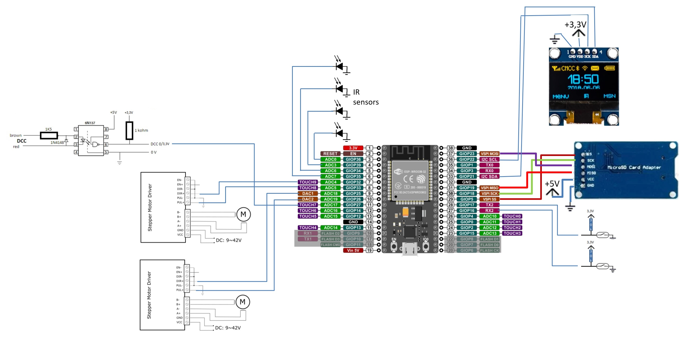

# Arduino controlled train elevator
At the time of writing this, I am planning to build an elevator for my scale H0 model train layout. 

The reason is my very limited space, where I will build up my next layout on shelves in a U-shape with no room for a hidden yard to park trains.

Hence, I will use wall space for that purpose.

So far, the physical elevator is only a CAD drawing: 

However, the electronics exists, albeit only as a mock-up.

## Hardware

The hardware consist of:
  - ESP32 DoIT module (serving the elevator control and a WEB page turning a phone or a PC into the UI)
  - SD card reader to store the HTML files, icons etc.
  - A tiny OLED display to show the status of the elevator
  - Stepper motors to drive the elevator
  - An optocoupler and a few diodes and resistors to act as a DCC interface
  - 20 volt power supply to drive the stepper motors
  - 5 volt power supply for the control system
  - Two micro switches to sense the end-stop position of each side of the elevator
  - Optical sensors for ensuring there is no train "sticking out" when moving the elevator

And it is put together as follows (with all sensors shown as switches). Note also that so far, I don't think I will need the "enable" wire to the stepper motors. Removing power from the steppers would only mean that the ESP32 is no longer knowing the exact location of the elevator:

I was at first almost done with the WIFI version, which uses a Web browser as UI. But because of weak WIFI connection, I abandoned that idea and instead began the Serial version, which simply connects via the USB port of the ESP32 to a PC and communicates directly with either JMRI (Java Model Railroad Interface) or the Python based UI. Or for that matter, the serial monitor in the Arduino IDE can be used as a command-line. Note that the SD card is not used by the serial version. So I have removed that.

See more at http://lisby.dk/wordpress/?p=2779 (so far only in Danish).
