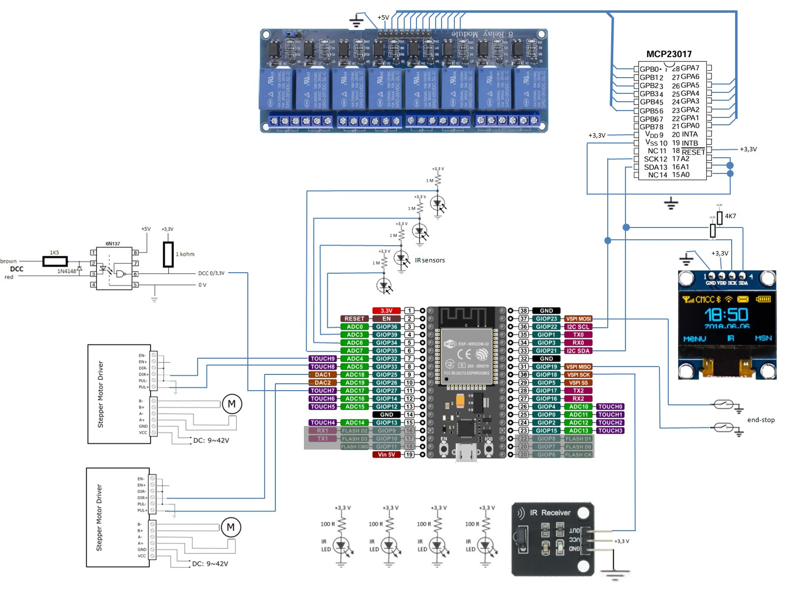

# Arduino controlled train elevator
At the time of writing this, I am building an elevator for my scale H0 model train layout. 

The reason is my very limited space, where I will build up my next layout on shelves in a U-shape with no room for a hidden yard to park trains.

Hence, I will use wall space for that purpose.

The physical elevator lokks as follows on a CAD drawing: 

So far, the electronics exists only as a mock-up.

## Hardware

The hardware consist of:
  - ESP32 DoIT module (serving the elevator control and a WEB page turning a phone or a PC into the UI)
  - SD card reader to store the HTML files, icons etc. (only used for the WEB UI and therefore abandoned as I switched to the serial version)
  - A tiny 0,96" (later replaced with a 2,43") OLED display to show the status of the elevator
  - Stepper motors to drive the elevator
  - An optocoupler and a few diodes and resistors to act as a DCC interface
  - 20 volt power supply to drive the stepper motors
  - 5 volt power supply for the control system (not needed after switch to serial version, where the 5V comes from the USB connection from my PC)
  - Two micro switches to sense the end-stop position of each side of the elevator
  - Optical sensors for ensuring there is no train "sticking out" when moving the elevator
  - Relay modules (12 relays needed, even though ony 8 are shown below) to provide power to only the tracks of the current level
  - MCP23017 I/O port expansion module to provide output ports for the relays

And it is put together as follows. Note that I will not need the "enable" wire to the stepper motors. Removing power from the steppers would only mean that the ESP32 is no longer knowing the exact location of the elevator.

Version 1:

Version 2:

I was at first almost done with the WIFI version, which uses a Web browser as UI. But because of weak WIFI connection, I abandoned that idea and instead began the Serial version, which simply connects via the USB port of the ESP32 to a PC and communicates directly with either JMRI (Java Model Railroad Interface) or the Python based UI. Or for that matter, the serial monitor in the Arduino IDE can be used as a command-line. Note that the SD card is not used by the serial version. So I have removed that.

See more at http://lisby.dk/wordpress/?p=2779 (so far only in Danish).
